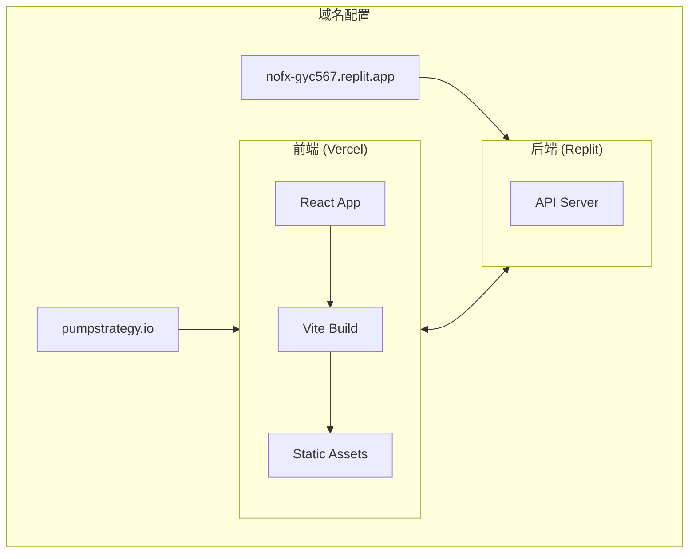

## 产品概述

将 Agent Trade 项目迁移到 pumpstrategy.io 域名，完成品牌重塑、Logo 设计、域名配置更新，并输出完整的前端技术文档。

## 核心功能

- 品牌替换：将所有 "Agent Trade" / "Monnaire" 相关品牌名称替换为 "PumpStrategy"
- Logo 设计：设计简约干练的新 Logo，体现 AI 交易策略平台定位
- 域名配置更新：将前端域名从 agentrade.xyz 迁移到 pumpstrategy.io
- 技术文档输出：输出前端技术栈、部署服务器、页面结构等完整文档
- 操作记录：记录所有替换操作并写入迁移文档

## 技术栈

- 前端框架：Vite + React + TypeScript
- 样式方案：Tailwind CSS
- 部署平台：前端 Vercel，后端 Replit
- 当前后端域名：nofx-gyc567.replit.app

## 技术架构

### 系统架构



### 模块划分

- **品牌资源模块**：Logo、Favicon、品牌名称、品牌色彩
- **配置模块**：环境变量、API 端点、域名配置
- **页面模块**：各页面组件中的品牌引用
- **文档模块**：技术文档、迁移记录

### 数据流

用户访问 pumpstrategy.io → Vercel 托管的静态资源 → React 应用加载 → API 请求到 Replit 后端

## 实施细节

### 核心目录结构（需修改的文件）

```
agentrade/
├── public/
│   ├── Monnaire_Logo.svg      # 需替换为新 Logo
│   └── favicon.ico            # 需更新 Favicon
├── src/
│   ├── assets/
│   │   └── logo/              # Logo 资源目录
│   ├── components/
│   │   └── Header/            # 包含 Logo 引用的组件
│   └── config/
│       └── constants.ts       # 品牌名称、域名常量
├── index.html                 # 标题、meta 信息
├── vercel.json                # Vercel 部署配置
├── .env                       # 环境变量
└── docs/
    └── migration-log.md       # 迁移记录文档（新建）
```

### 关键代码结构

**品牌常量定义**：集中管理品牌相关常量，便于统一替换

```typescript
// src/config/constants.ts
export const BRAND = {
  name: 'PumpStrategy',
  domain: 'pumpstrategy.io',
  tagline: 'AI Trading Strategy Platform',
  logo: '/pumpstrategy-logo.svg'
}
```

**Logo 组件接口**：统一 Logo 组件调用方式

```typescript
// Logo 组件 Props
interface LogoProps {
  size?: 'sm' | 'md' | 'lg';
  variant?: 'full' | 'icon';
  className?: string;
}
```

### 技术实施计划

1. **品牌资源替换**

- 问题：需要替换所有品牌相关资源
- 方案：使用全局搜索定位所有引用点，统一替换
- 技术：grep/ripgrep 搜索，批量替换
- 步骤：搜索 → 记录 → 替换 → 验证
- 测试：本地运行验证所有页面显示正确

2. **Logo 设计与集成**

- 问题：需要设计符合 AI 交易策略平台定位的 Logo
- 方案：设计简约干练的 SVG Logo
- 技术：SVG 格式，支持多尺寸适配
- 步骤：设计 → 导出 SVG → 集成到项目 → 更新引用
- 测试：验证各页面 Logo 显示效果

3. **域名配置更新**

- 问题：需要更新所有域名引用
- 方案：更新环境变量和配置文件
- 技术：Vercel 域名绑定，环境变量配置
- 步骤：更新配置 → 更新 Vercel 设置 → DNS 配置
- 测试：验证域名解析和 HTTPS 证书

### 集成点

- Vercel 部署：更新域名绑定配置
- DNS 配置：pumpstrategy.io 指向 Vercel
- API 端点：确保后端 CORS 配置支持新域名

## Agent Extensions

### SubAgent

- **code-explorer**
- 用途：全面搜索项目中所有品牌相关引用（Agent Trade、Monnaire、agentrade.xyz 等）
- 预期结果：输出所有需要替换的文件列表和具体位置，确保无遗漏

### MCP

- **kuikly-mcp**
- 用途：咨询 Logo 设计建议和 AI 交易策略平台的视觉风格方向
- 预期结果：获取专业的设计建议，指导 Logo 设计方向